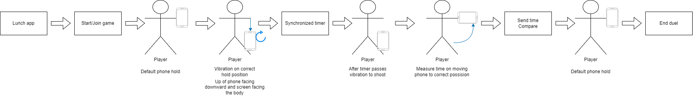

# SM_Project_BANG
Studies project of BANG game for mobile systems

## Concept

BANG is a dueling game where two (or more) people face each other in a series of duels. This duel similar to all wester revolver duels but instead of revoler you use your phone. As a result core mechanic of the game revolves around `placing phone in holster` and `drawing phone from holster`. 

Example 2 player flow could be described in this steps:

1. Player 1 and Player 2 starts the app.
2. Player 1 creates lobby and gives invite to Player 2.
3. Player 2 joins the lobby.
4. Both Players confirm their readines.
5. Game starts both Players should place press the ready button.
6. When both Players are ready internal timer starts the game.
7. After 5s time period Players are notified by another vibration to shoot.
8. Each Player shoots (Rise arm with phone upward as fast as possible).
9. Times for rising the phone are compared and faster Player wins.
10. Game ends, Players return to title screen.

This example flow was also ilustraed in diagram below.

(Optional feature) For more than 2 players duels you choose which Player is your target. Most chosen and slowest Player dies, and the next rounds continues until single winner is decided.
